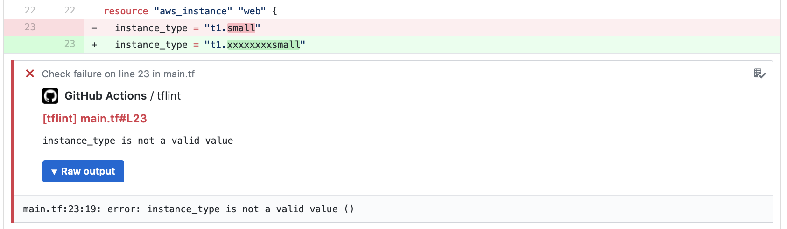

# GitHub Action: Run tflint with reviewdog

This action runs [tflint](https://github.com/wata727/tflint) with
[reviewdog](https://github.com/reviewdog/reviewdog) on pull requests
to enforce best practices.

## Examples

### With `github-pr-check`

By default, with `reporter: github-pr-check` an annotation is added to
the line:



### With `github-pr-review`

With `reporter: github-pr-review` a comment is added to
the Pull Request Conversation:


## Inputs

### `github_token`

**Required**. Must be in form of `github_token: ${{ secrets.github_token }}`.

### `level`

Optional. Report level for reviewdog [`info`,`warning`,`error`].
It's same as `-level` flag of reviewdog.
The default is `error`.

### `reporter`

Optional. Reporter of reviewdog command [`github-pr-check`,`github-pr-review`].
The default is `github-pr-check`.

### `filter_mode`

Optional. Filtering for the reviewdog command [`added`,`diff_context`,`file`,`nofilter`].

The default is `added`.

See [reviewdog documentation for filter mode](https://github.com/reviewdog/reviewdog/tree/master#filter-mode) for details.

### `fail_level`

Optional. If set to `none`, always use exit code 0 for reviewdog.
Otherwise, exit code 1 for reviewdog if it finds at least 1 issue with severity greater than or equal to the given level.
Possible values: [`none`, `any`, `info`, `warning`, `error`]
Default is `none`.

### `fail_on_error`

Deprecated, use `fail_level` instead.
Optional. Exit code for reviewdog when errors are found [`true`,`false`].

The default is `false`.

See [reviewdog documentation for exit codes](https://github.com/reviewdog/reviewdog/tree/master#exit-codes) for details.

### `working_directory`

Optional. Directory to run the action on, from the repo root.
The default is `.` ( root of the repository).

### `tflint_version`

Optional. The tflint version to install and use.
The default is `latest`.

### `tflint_rulesets`

Optional. Space separated, official (from the terraform-linters GitHub organization) tflint rulesets to install and use. If a pre-configured `TFLINT_PLUGIN_DIR` is set, rulesets are installed in that directory.
Default is `` (empty).

### `tflint_init`

Optional. Whether to run `tflint --init` prior to linting (useful if you have a .tflint.hcl with some values in it).
The default is `false`.

### `tflint_target_dir`

Optional. The target dir for the tflint command. This is the directory passed to tflint as opposed to working_directory which is the directory the command is executed from.
The default is `.`.

### `tflint_config`

Optional. Config file name for tflint.
The default is `.tflint.hcl`

### `flags`

Optional. List of arguments to send to `tflint`.
For the output to be parsable by reviewdog [`--format=checkstyle` is enforced](./entrypoint.sh).
The default is `--call-module-type=all`.

## Outputs

## `tflint-return-code`

The `tflint` command return code.

## `reviewdog-return-code`

The `reviewdog` command return code.

## Example usage

```yml
name: reviewdog
on: [pull_request]
jobs:
  tflint:
    name: runner / tflint
    runs-on: ubuntu-latest

    steps:
      - name: Clone repo
        uses: actions/checkout@11bd71901bbe5b1630ceea73d27597364c9af683 # v4.2.2

      # Install latest Terraform manually as
      #  Docker-based GitHub Actions are
      #  slow due to lack of caching
      # Note: Terraform is not needed for tflint
      - name: Install Terraform
        run: |
          brew install terraform

      # Run init to get module code to be able to use `--call-module-type=all`
      - name: Terraform init
        run: |
          terraform init

      # Minimal example
      - name: tflint
        uses: step-security/action-tflint@41b4770c9d9e50741c20e431986b33124a07ca52 # v1.24.2
        with:
          github_token: ${{ secrets.github_token }}

      # More complex example
      - name: tflint
        uses: step-security/action-tflint@41b4770c9d9e50741c20e431986b33124a07ca52 # v1.24.2
        with:
          github_token: ${{ secrets.github_token }}
          working_directory: "testdata" # Optional. Change working directory
          reporter: github-pr-review # Optional. Change reporter
          fail_level: "any" # Optional. Fail action if it finds at least 1 issue with severity greater than or equal to the given level.
          filter_mode: "nofilter" # Optional. Check all files, not just the diff
          tflint_version: "v0.24.0" # Optional. Custom version, instead of latest
          tflint_rulesets: "azurerm google" # Optional. Extra official rulesets to install
          flags: "--call-module-type=all" # Optional. Add custom tflint flags
```

### Lint - reviewdog integration

This reviewdog action template itself is integrated with reviewdog to run lints
which is useful for Docker container based actions.

